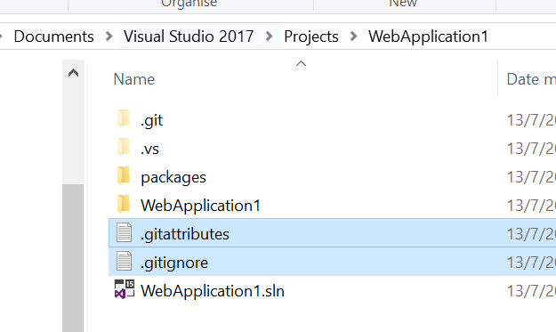

# Git-Hints
Summary of the useful of git

### Autogenerated by Visual Studio
1. [.gitignore file](./.gitignore)
2. [.gitattributes file](./.gitattributes)

How to use:
1. Copy and paste those 2 files at the root level 

